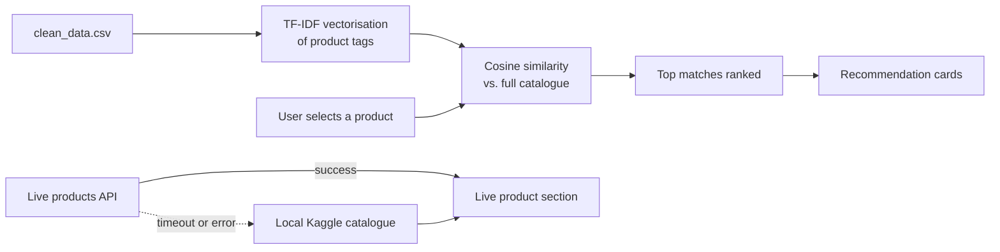

<div align="center">

<a id="top"></a>

# 🔎 Findwise

**Smarter product discovery, powered by content-based recommendations and live product data.**

Findwise pairs a Kaggle-derived Walmart catalogue with TF-IDF similarity to surface genuinely related products, then layers a live product feed on top for a storefront that always feels current.

[](https://www.python.org/)
[](https://flask.palletsprojects.com/)
[](LICENSE)

[**Quick start**](#-quick-start) · [**How it works**](#-how-it-works) · [**Live data**](#-live-data) · [**Routes**](#-routes) · [**Troubleshooting**](#-troubleshooting)

</div>

---

## 📑 Table of contents

- [Features](#-features)
- [Quick start](#-quick-start)
- [How it works](#-how-it-works)
- [Live data](#-live-data)
- [Routes](#-routes)
- [Project layout](#-project-layout)
- [Troubleshooting](#-troubleshooting)
- [License](#-license)

---

## ✨ Features

| | Feature | Description |
| :---: | --- | --- |
| 🧠 | **Content-based recommendations** | Suggests similar items using TF-IDF vectors built from the Walmart/Kaggle product catalogue. |
| 🛒 | **Live product cards** | Displays images, prices, ratings, and stock levels pulled from a live API. |
| 🔄 | **Auto-refresh** | Live data updates every 60 seconds, with a manual **Refresh** button for on-demand updates. |
| 🧭 | **Complete storefront** | Polished Home, Why Us, Contact, and recommendation results pages. |
| 🎨 | **Personalised browsing** | Light/dark theme toggle, brand and category filters, and saved items. |
| 📱 | **Responsive design** | Layouts adapt cleanly to desktop, tablet, and mobile screens. |
| 🛟 | **Offline resilience** | Falls back to the local catalogue automatically if the live API is unreachable. |

<p align="right"><a href="#top">⬆ Back to top</a></p>

---

## 🚀 Quick start

Get Findwise running locally in three steps.

- [ ] **Step 1:** Create a virtual environment
- [ ] **Step 2:** Install dependencies
- [ ] **Step 3:** Launch the app

### 1. Create a virtual environment

<details open>
<summary><b>🪟 Windows (PowerShell)</b></summary>

```powershell
python -m venv .venv
.\.venv\Scripts\Activate.ps1
```

</details>

<details>
<summary><b>🍎 macOS / 🐧 Linux</b></summary>

```bash
python -m venv .venv
source .venv/bin/activate
```

</details>

### 2. Install dependencies

```bash
python -m pip install -r requirements.txt
```

### 3. Launch the app

```bash
python -m flask --app app run --debug --port 5000
```

Then open **[http://127.0.0.1:5000](http://127.0.0.1:5000)** in your browser. 🎉

> [!TIP]
> Running into issues during setup? Jump straight to [Troubleshooting](#-troubleshooting).

<p align="right"><a href="#top">⬆ Back to top</a></p>

---

## ⚙️ How it works

Findwise runs two independent pipelines: one for recommendations and one for live product data.



<details>
<summary><b>Step-by-step breakdown</b></summary>

1. **Load and vectorise:** `clean_data.csv` is loaded and each product's tags are converted into TF-IDF vectors.
2. **Compare:** The selected product is scored against the entire catalogue using cosine similarity.
3. **Rank and render:** The closest matches are sorted and displayed as recommendation cards.
4. **Fetch live data:** The home page separately requests current products from a free live API.
5. **Fall back gracefully:** If the API is unavailable, the live section shows products from the local Kaggle-derived catalogue instead.

</details>

<p align="right"><a href="#top">⬆ Back to top</a></p>

---

## 📡 Live data

By default, Findwise uses the free **[DummyJSON Products API](https://dummyjson.com/docs/products)**. You can point it at any compatible endpoint by setting the `LIVE_PRODUCTS_URL` environment variable, with no code changes required.

<details open>
<summary><b>🪟 Windows (PowerShell)</b></summary>

```powershell
$env:LIVE_PRODUCTS_URL = "https://your-api.example/products"
python -m flask --app app run --debug --port 5000
```

</details>

<details>
<summary><b>🍎 macOS / 🐧 Linux</b></summary>

```bash
export LIVE_PRODUCTS_URL="https://your-api.example/products"
python -m flask --app app run --debug --port 5000
```

</details>

<details>
<summary><b>📋 Expected response format</b></summary>

The endpoint should return a JSON object containing a `products` array. Each product may include the following fields:

```json
{
  "products": [
    {
      "title": "Wireless Headphones",
      "brand": "Acme",
      "category": "electronics",
      "price": 59.99,
      "rating": 4.5,
      "stock": 120,
      "thumbnail": "https://example.com/image.jpg"
    }
  ]
}
```

</details>

<p align="right"><a href="#top">⬆ Back to top</a></p>

---

## 🗺️ Routes

| Route | Purpose |
| --- | --- |
| `/` | Home page with live product discovery |
| `/recommendations?prod=<name>&nbr=8` | Recommendations similar to the given product (`nbr` sets the number of results) |
| `/why-us` | Overview of the product and how recommendations work |
| `/contact` | Contact form |
| `/api/live-products` | Live product feed as JSON |

> [!NOTE]
> Try it out: with the app running, visit [`/api/live-products`](http://127.0.0.1:5000/api/live-products) to inspect the raw live feed.

<p align="right"><a href="#top">⬆ Back to top</a></p>

---

## 📁 Project layout

```text
findwise/
├── app.py                  # Flask routes and recommendation engine
├── clean_data.csv          # Kaggle-derived recommendation catalogue
├── trending_products.csv   # Kaggle-derived trending products
├── templates/              # Home, results, Why Us, Contact, and card templates
├── style.css               # Responsive visual system
├── ui.js                   # Theme, filters, saved items, and live refresh
├── requirements.txt        # Python dependencies
└── LICENSE                 # MIT license
```

<p align="right"><a href="#top">⬆ Back to top</a></p>

---

## 🛠️ Troubleshooting

<details>
<summary><b>⚠️ The live section shows "unavailable"</b></summary>

<br>

No need to worry: the app is still working. The live API either timed out or returned an error, so Findwise has switched to local catalogue data.

**To resolve:**
- Check your internet connection.
- Set `LIVE_PRODUCTS_URL` to another compatible endpoint (see [Live data](#-live-data)).

</details>

<details>
<summary><b>🔒 PowerShell blocks virtual environment activation</b></summary>

<br>

Skip activation and run the app with the environment's Python directly:

```powershell
.\.venv\Scripts\python.exe -m flask --app app run --debug --port 5000
```

</details>

<details>
<summary><b>🚧 Port 5000 is already in use</b></summary>

<br>

Start the app on a different port:

```bash
python -m flask --app app run --debug --port 5001
```

Then open [http://127.0.0.1:5001](http://127.0.0.1:5001).

</details>

<p align="right"><a href="#top">⬆ Back to top</a></p>

---

## 📄 License

Findwise is released under the **[MIT License](LICENSE)**.

<div align="center">

<br>

Made with ☕ and cosine similarity.

<a href="#top">⬆ Back to top</a>

</div>
